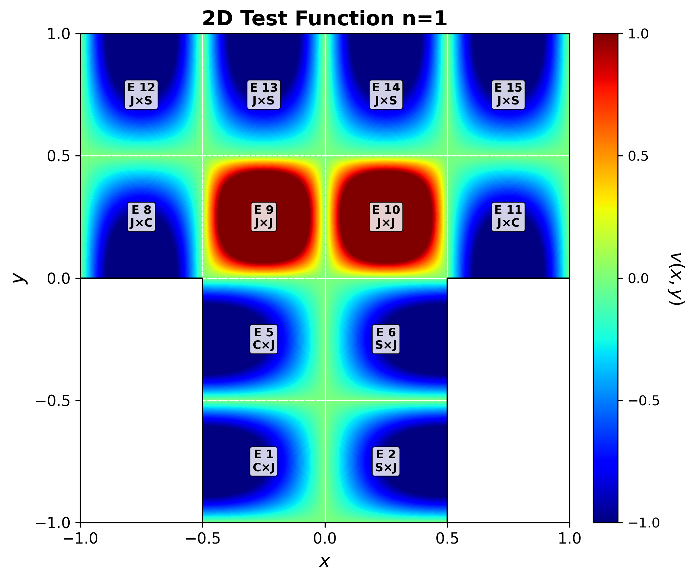
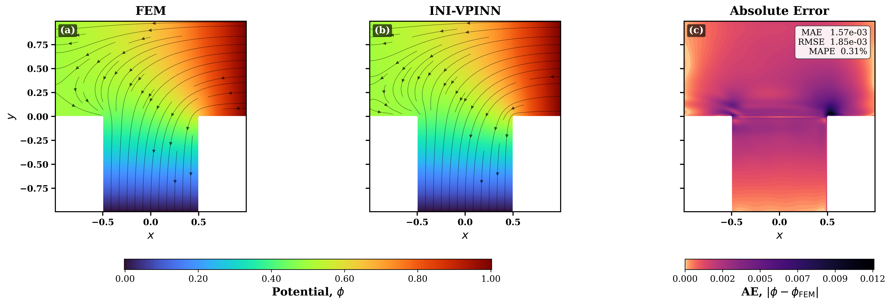
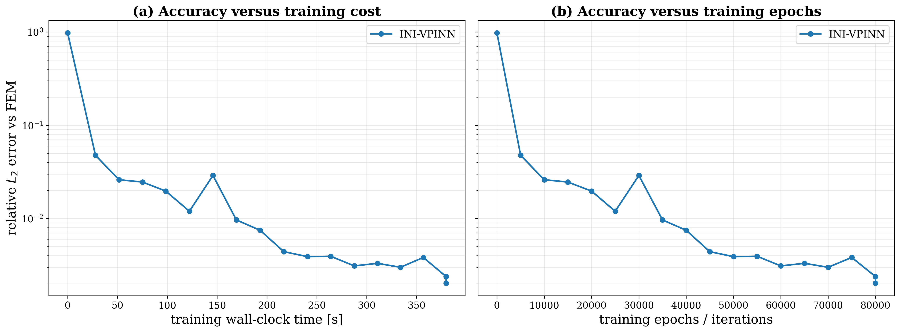

# INI-VPINN v1.0.0

**A Variational Physics-Informed Neural Network with Implicit Neumann and Interface Handling for Multi-Material Domains with Geometric Singularities**

**Authors:** Shayan Dodge, Alessandro Formisano, Sami Barmada  
**Journal:** *Journal of Computational Physics (JCP)*  
**DOI:** [10.1016/j.jcp.2026.115328](https://doi.org/10.1016/j.jcp.2026.115328)  
**Links:** [ScienceDirect](https://www.sciencedirect.com/science/article/pii/S0021999126006777) · [arXiv](https://arxiv.org/abs/2606.18032) · [ResearchGate](https://www.researchgate.net/publication/413656372_INI-VPINN_A_Variational_Physics-Informed_Neural_Network_with_Implicit_Neumann_and_Interface_Handling_for_Multi-Material_Domains_with_Geometric_Singularities)

INI-VPINN is a weak-form physics-informed neural-network framework designed to handle Neumann boundary and material-interface conditions implicitly within the variational formulation.

## Release status

### v1.0.0 — Homogeneous T-shaped benchmark

The first public release provides the **homogeneous T-shaped benchmark**, including training, operator-guided test-function configuration, FEM validation, convergence history, and publication-ready plots.

The main notebook is:

```text
INI_VPINN_v1.0.0_Homogeneous.ipynb
```

### Coming next

Future releases will progressively add:

- non-homogeneous boundary-condition benchmarks;
- Poisson-equation benchmarks;
- non-rectangular geometries and additional geometric-singularity cases.

## Operator configuration

Main numerical and training parameters are grouped in the notebook:

```python
N_el_x = 4
N_el_y = 4
N_quad = 7
N_test_x = N_el_x * [5]
N_test_y = N_el_y * [5]
Net_layer = [2] + [18] * 8 + [1]
N_TRAIN_ITER = 80000 + 1
```

### 1. Check the subdomain numbering first

Before choosing test functions, enable:

```python
SHOW_SUBDOMAIN_NUMBERS = True
```

For the default `4 × 4` grid, element IDs are numbered row-wise:

<table>
  <tr>
    <td><b>12</b></td><td><b>13</b></td><td><b>14</b></td><td><b>15</b></td>
  </tr>
  <tr>
    <td><b>8</b></td><td><b>9</b></td><td><b>10</b></td><td><b>11</b></td>
  </tr>
  <tr>
    <td><s>4</s></td><td><b>5</b></td><td><b>6</b></td><td><s>7</s></td>
  </tr>
  <tr>
    <td><s>0</s></td><td><b>1</b></td><td><b>2</b></td><td><s>3</s></td>
  </tr>
</table>

**Bold** numbers are active T-shaped subdomains; ~~crossed-out~~ numbers are inactive and excluded from the weak-form assembly.

For the T-shaped domain, the lower corner elements are inactive. The numbering plot should be used as the operator's guide when editing the element-wise test-function dictionaries.

### 2. Choose the test-function family

The paper uses three weighting-function families and the compact notation **J**, **C**, and **S**:

| Paper notation | Weighting-function family | Internal code name | Endpoint behavior on the local element |
| --- | --- | --- | --- |
| `J` | Jacobi difference mode | `jacobi` | zero at both ends |
| `C` | odd cosine mode | `trig1to0` | nonzero at `-1`, zero at `+1` |
| `S` | odd sine mode | `trig0to1` | zero at `-1`, nonzero at `+1` |

The internal names `trig1to0` and `trig0to1` are kept in the notebook, while plots use the same **C/S/J notation as the paper**. For a 2D element, the x- and y-families are combined by tensor product and displayed as, for example, `C×J`, `J×S`, or `J×J`.

For operator selection:

```text
x: LEFT Neumann side   -> C  (trig1to0)
x: RIGHT Neumann side  -> S  (trig0to1)
y: BOTTOM Neumann side -> C  (trig1to0)
y: TOP Neumann side    -> S  (trig0to1)
otherwise               -> J  (jacobi)
```

The v1.0.0 configuration is:

```python
default_type = "jacobi"

element_types_x = {
    1: "trig1to0",
    5: "trig1to0",
    2: "trig0to1",
    6: "trig0to1",
}

element_types_y = {
    8: "trig1to0",
    11: "trig1to0",
    12: "trig0to1",
    13: "trig0to1",
    14: "trig0to1",
    15: "trig0to1",
}
```

### 3. Visualize before training

Enable the operator checks:

```python
SHOW_TEST_CONFIG = True
SHOW_TEST_FAMILIES = True
```

The resulting 2D weighting function is formed from the selected one-dimensional functions in the `x` and `y` directions. The first mode provides a simple visual check of the complete T-shaped arrangement. Each active subdomain is labeled with its element number and paper notation (`J×J`, `C×J`, `J×S`, etc.):

<p align="center">
  
</p>

The color scale is fixed from `-1` to `+1` for a consistent visual reference. Before training, the operator should check the element numbering and confirm that each `C`, `S`, or `J` assignment agrees with the intended boundary location.

## Included files

```text
INI_VPINN_v1.0.0_Homogeneous.ipynb
V_T_200.txt
INIVPINN_TD.txt
INI_ERROR_VS_WALLTIME.npz
INI_VPINN_2D_Test_Function_n1.png
Tshape_FEM_INI_Homogeneous.png
Tshape_FEM_INI_Homogeneous.pdf
ERROR_VS_WALLTIME_AND_EPOCHS_INI.png
```

## Benchmark results

### FEM comparison

FEM reference, INI-VPINN prediction, and absolute error:



For the supplied v1.0.0 run:

- **MAE:** `1.57e-03`
- **RMSE:** `1.85e-03`
- **MAPE:** `0.31%`

### Convergence history

Relative $L_2$ error versus wall-clock time and training iterations:



## Run

Open `INI_VPINN_v1.0.0_Homogeneous.ipynb` and execute the cells in order.

For a quick smoke test, temporarily use:

```python
N_TRAIN_ITER = 100
```

Then restore the intended training value for the final run.

## Citation

If you use INI-VPINN, this code, or the supplied results, please cite:

> Shayan Dodge, Alessandro Formisano, Sami Barmada, **“INI-VPINN: A Variational Physics-Informed Neural Network with Implicit Neumann and Interface Handling for Multi-Material Domains with Geometric Singularities,”** *Journal of Computational Physics*, 565, 115328, 2026. https://doi.org/10.1016/j.jcp.2026.115328

```bibtex
@article{dodge2026inivpinn,
  title   = {INI-VPINN: A variational physics-informed neural network with implicit Neumann and interface handling for multi-material domains with geometric singularities},
  author  = {Dodge, Shayan and Formisano, Alessandro and Barmada, Sami},
  journal = {Journal of Computational Physics},
  volume  = {565},
  pages   = {115328},
  year    = {2026},
  doi     = {10.1016/j.jcp.2026.115328}
}
```

## Paper and repository

For the formulation, derivation, test-function construction, and benchmark definitions, readers are strongly encouraged to read the paper.

- **Paper:** https://doi.org/10.1016/j.jcp.2026.115328
- **arXiv:** https://arxiv.org/abs/2606.18032
- **Repository:** https://github.com/ShayanDodge/INI-VPINN

If INI-VPINN is useful to your work, please ⭐ **star the repository** and cite the paper. This helps others discover the project and supports continued development and future benchmark releases.

